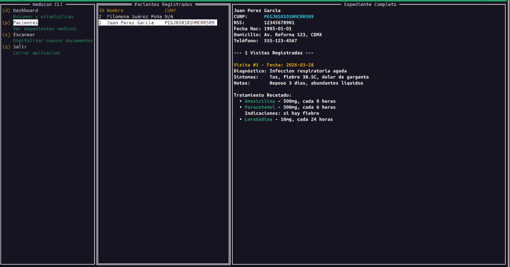

# MEDSCAN

`medscan` es una utilidad profesional de linea de comandos (CLI) e interfaz grafica de terminal (TUI) escrita en Go. Su proposito principal es la digitalizacion precisa de expedientes medicos fisicos (en papel), convirtiendolos de manera instantanea en formatos estructurados (JSON y bases de datos relacionales).

El sistema se apoya en modelos avanzados de Inteligencia Artificial con capacidad de vision computacional y persiste la informacion utilizando una arquitectura de base de datos local embebida.

<div align="center">
  
  <br />
  <p><i>Interfaz Grafica del Panel de Control Principal de MEDSCAN</i></p>
</div>

---

## Caracteristicas Principales

- **Tablero TUI Interactivo:** Visualizacion avanzada con controles navegables por teclado o raton. Incluye estadisticas en tiempo real, modulos maestro-detalle para pacientes y logs dinamicos.
- **Vision por Inteligencia Artificial:** Integracion nativa con Google Gemini y Anthropic Claude para transcripcion sofisticada, lectura de manuscritos medicos y clasificacion de recetas.
- **Deteccion de Imagenes Borrosas:** Evaluacion previa de calidad de imagen (mediante el algoritmo de Varianza del Laplaciano implementado en Go) para rechazar fotos desenfocadas, evitando el uso innecesario de cuota de red y de API.
- **Preprocesamiento en Entorno Local:** Mejoramiento de contraste automatizado, conversion a escala de grises limitando los umbrales maximos de anchura, logrando alta fidelidad.
- **Base de Datos Embebida Autosuficiente:** Persistencia local garantizada mediante SQLite, resuelta en un solo archivo binario. Olvidese de instalaciones adicionales o configuraciones de servidores de bases de datos complejos.

---

## Instalacion y Despliegue (Guia Multiplataforma)

La manera mas eficiente y segura de utilizar la herramienta en cualquier sistema operativo es haciendo uso de los binarios precompilados disponibles en la seccion **Releases** de este repositorio. **No se requiere instalar Go.**

### 1. Obtencion del Archivo Ejecutable

Navegue a la pagina de **Releases** y localice el ejecutable correspondiente a su plataforma.

#### Para Usuarios de Microsoft Windows (64 bits)
1. Descargue el archivo denominado `medscan-windows-amd64.exe`.
2. Renombre el archivo simplemente a `medscan.exe` para mayor comodidad.
3. Abra su linea de comandos (CMD o PowerShell) en el directorio de la descarga.
4. Continue al paso de configuracion inicial.

#### Para Usuarios de macOS (Apple)
1. Descargue `medscan-darwin-arm64` (si su equipo cuenta con procesadores de la serie M1/M2/M3) o bien `medscan-darwin-amd64` (si su equipo utiliza procesador Intel).
2. Renombre el archivo descargado a `medscan`.
3. Abra la aplicacion Terminal y ubique el archivo en el directorio correspondiente.
4. Otorgue los permisos necesarios ejecutando:
   ```bash
   chmod +x ./medscan
   ```
*(Nota para macOS: Si la ejecucion es bloqueada inicialmente por motivos de seguridad, dirijase a Configuracion del Sistema > Privacidad y Seguridad, y autorice la aplicacion).*

#### Para Usuarios de Linux (Distribuciones derivadas de Debian, Red Hat, Arch, etc.)
1. Descargue el archivo `medscan-linux-amd64` (para plataformas convencionales Intel/AMD) o `medscan-linux-arm64` (servidores y dispositivos ARM).
2. Renombrelo a un estandar comodo, como `medscan`.
3. Abra su emulador de terminal favorito y posicionece en el archivo.
4. Asigne permisos de ejecucion:
   ```bash
   chmod +x ./medscan
   ```

### 2. Configuracion Inicial Asistida

Para simplificar su utilizacion por primera vez, `medscan` incluye su propia herramienta de parametrizacion inteligente. Ejecute en su consola:

```bash
# En macOS o Linux:
./medscan setup

# En Windows:
.\medscan.exe setup
```

El asistente interactivo lo llevara de la mano para establecer:
1. Una llave de activacion (API Key) sin costo de los modelos disponibles.
2. La ruta local preferida donde residira su base de datos.
3. La generacion de un archivo de contexto local (`.env`).

### 3. Ejecucion de Tareas Principales (CLI y TUI)

`medscan` posee una gama de comandos dedicados para procesar la reporteria en sus expedientes medicos:

**Apertura del Panel Interactivo (Recomendado):**
Inicie directamente el sistema exploratorio y digitalizador:
```bash
./medscan
```

**Escaneo Silencioso / de Lotes:**
Para inyectar lotes directos de fotografias de historiales medicos en carpetas:
```bash
./medscan scan ./docs/
```

**Consulta de Pacientes y Estadisticas:**
Para revisar los volumenes de actividad de pacientes y encontrar coincidencias o errores en subidas pasadas:
```bash
./medscan patient list
./medscan query NUMERODECURP123
./medscan db stats
```

---

## Compilacion desde el Codigo Fuente

Si usted cuenta con experiencia como desarrollador y dispone del compilador Go (`v1.22+`), el entorno de construccion esta preparado.

```bash
git clone https://github.com/AndreRaz/medscan-CLI.git
cd medscan-CLI
make build
```

Esta instruccion le provera el ejecutable `./medscan` en su carpeta actual, el cual puede utilizar del mismo modo indicado previamente. Todo requerimiento externo de librerias sera manejado internamente por el `go.mod`.
